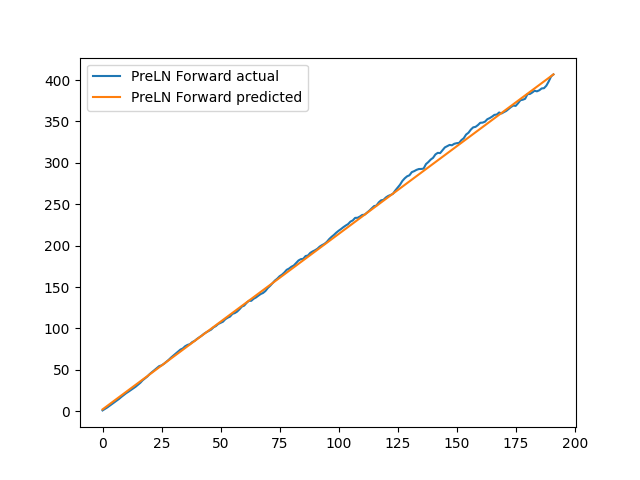
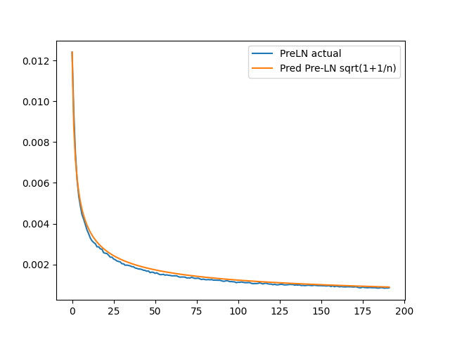
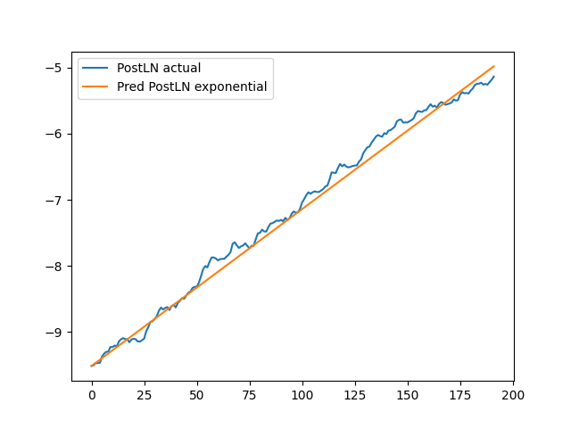
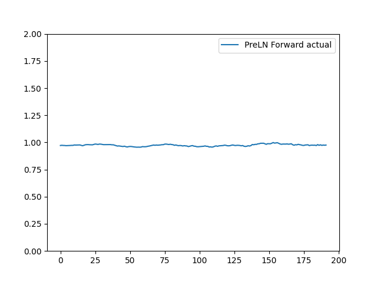
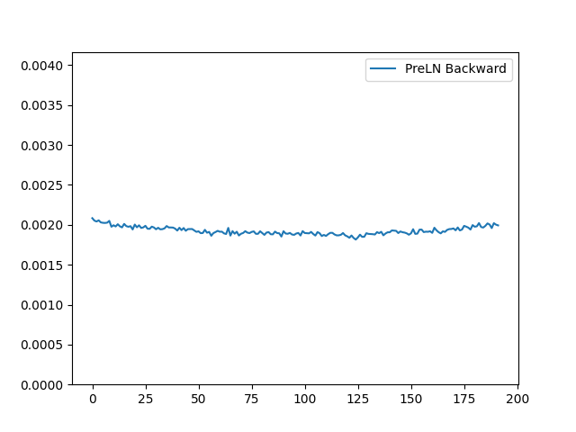
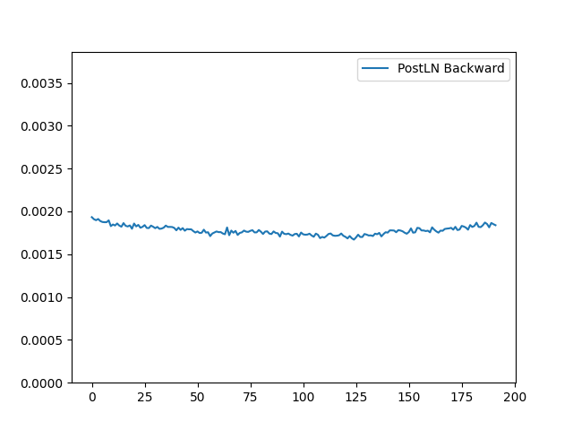

# Transformers Get Stable: An End-to-End Signal Propagation Theory for Language Models

🌟 [ArXiv Preprint](https://arxiv.org/abs/2403.09635) | [ICML Poster](https://icml.cc/virtual/2024/poster/35085)

Train transformers with 1000 layers!

## 🔗 Quick Links

- [Transformers Get Stable: An End-to-End Signal Propagation Theory for Language Models](#transformers-get-stable-an-end-to-end-signal-propagation-theory-for-language-models)
  - [🔗 Quick Links](#-quick-links)
  - [Brief Introduction](#brief-introduction)
  - [Simulations](#simulations)
    - [Environment Setup](#environment-setup)
    - [Running](#running)
    - [Expected Output](#expected-output)
  - [Xavier Signal Propagation Figures](#xavier-signal-propagation-figures)
    - [Running](#running-1)
    - [Expected Output](#expected-output-1)
  - [DSLM Signal Propagation Figures](#dslm-signal-propagation-figures)
    - [Environment Setup](#environment-setup-1)
    - [Running](#running-2)
    - [Expected Output](#expected-output-2)
  - [Baseline BERT Model Pretraining and Finetuning](#baseline-bert-model-pretraining-and-finetuning)
    - [Running](#running-3)
  - [Bugs or Questions?](#bugs-or-questions)
  - [Citation](#citation)

## Brief Introduction

We share the code for -

1. Running simuations on singal propagation for transformer components, written in simple pytorch. See the section [Simulations](#simulations)
1. Signal propagation for the entire transformer model, see [Xavier Signal Propagation Figures](#xavier-signal-propagation-figures)
1. Signal propagation for our proposed changes to transformer architecture, DeepScaleLM. See [DSLM Signal Propagation Figures](#dslm-signal-propagation-figures)
1. For running baseline pretraining and downstream finetuning on BERT without DeepScaleLM to reproduce our results.

The entire model signal propagation and BERT training are based on [Nvidia Megatron](https://github.com/NVIDIA/Megatron-LM). HuggingFace code for DeepScaleLM will be released soon!

Each folder has a readme with instructions to run the same!

## Simulations

### Environment Setup

Use `pip install -r simulations/requirements.txt`. Only requires torch, numpy, tqdm and matplotlib. A CUDA GPU is required as well, tested on 1 A100.

### Running

Run the file `run_all.sh` to reproduce all our simulations for transformer components. The file `approximations.py` can also plots the approximations of RELU/MLP covariance.

### Expected Output

Expected output is provided in `expected_output.txt`

## Xavier Signal Propagation Figures

These figures show forward and back change in variances for vanilla transformer models.

### Running

cd into `xavier_signal_propagation_figures` and run the file `make_figs.sh`.

It will make xavier figures `preln_forward.png`, `preln_backward.png` and `postln_backward.png` and exit.

These files are already included, delete these `.png` files to recreate.

### Expected Output





## DSLM Signal Propagation Figures

These figures show Unit forward and back change in variances.

### Environment Setup

Use `conda env create -f environment.yml`. Tested on 8x A100 80GB. Same enviroment is also required for Xavier and Pre-training.

Also requires pre-training data from `bert_wiki_pretraining/prepare_data.sh`

### Running

cd into `DSLM_signal_propagation_figures` and run the file `make_figs.sh`.

It will make xavier figures `preln_forward.png`, `preln_backward.png` and `postln_backward.png` and exit.

These files are already included, delete these `.png` files to recreate.

### Expected Output





## Baseline BERT Model Pretraining and Finetuning

### Running

1. cd into `bert_wiki_pretraining`
1. Run the file `prepare_data.sh` to download and process the pre-training dataset. This is Wikipedia from TFDS.
1. Run the file `run_bert_wiki.sh` to run the pretraining.
1. Run the files `examples/run_mnli.sh`, `examples/run_qqp.sh`, `examples/run_race.sh` to run finetuning.

## Bugs or Questions?

If you have any questions related to the code or the paper, feel free to email Akhil Kedia (akhil.kedia @ samsung.com). If you encounter any problems when using the code, you can open an issue!

## Citation

Please cite our paper if you find the repo helpful in your work:

```bibtex
@article{DSLM,
  author       = {Akhil Kedia and
                  Mohd Abbas Zaidi and
                  Sushil Khyalia and
                  Jungho Jung and
                  Harshith Goka and
                  Haejun Lee},
  title        = {Transformers Get Stable: An End-to-End Signal Propagation Theory for
                  Language Models},
  journal      = {CoRR},
  volume       = {abs/2403.09635},
  year         = {2024},
  url          = {https://doi.org/10.48550/arXiv.2403.09635},
  doi          = {10.48550/ARXIV.2403.09635},
  eprinttype    = {arXiv},
  eprint       = {2403.09635}
}
```
